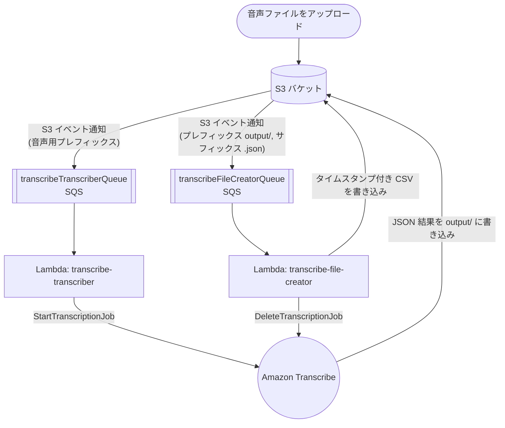

# convert-speech-to-text

> 音声ファイルを S3 に置くだけで、タイムスタンプ付きの CSV 文字起こしが返ってくる。完全サーバーレス、Terraform でデプロイ。

[](https://github.com/ryo8000/convert-speech-to-text/actions/workflows/python-app.yml)
[](./LICENSE)
[](https://www.python.org/)
[](https://www.terraform.io/)

**convert-speech-to-text** は、音声ファイルをタイムスタンプ付きの文字起こしに変換する、AWS 上のイベント駆動型サーバーレスパイプラインです。
S3 バケットに音声ファイルをアップロードすると、しばらくして同じバケットに CSV 文字起こしファイル（単語ごとの開始／終了タイムスタンプ付き）が生成されます。
音声認識は Amazon Transcribe が担当し、2 つの小さな AWS Lambda 関数がオーケストレーションを行い、Terraform がすべてのリソースをプロビジョニングします。

🇬🇧 [English version here](./README.md)

## 仕組み

このパイプラインは完全にイベント駆動です。S3 にオブジェクトが作成されると SQS メッセージが送信され、Lambda 関数が起動します。
このステージが 2 つあり、1 つは Amazon Transcribe のジョブを開始し、もう 1 つはジョブの JSON 出力を CSV に変換します。



1. 任意のプレフィックス配下に、音声ファイルが S3 バケットへアップロードされます。
2. S3 イベント通知により、**transcribeTranscriberQueue** にメッセージが送信されます。
3. **transcribe-transcriber** Lambda がメッセージを受け取り、Amazon Transcribe の `StartTranscriptionJob` を呼び出します。
   出力先は文字起こし出力キー（デフォルト `output/`）です。
4. Amazon Transcribe は JSON 結果を S3 の `output/` 配下に書き込みます。
5. 2 つ目の S3 イベント通知（プレフィックス `output/`、サフィックス `.json`）により、**transcribeFileCreatorQueue** にメッセージが送信されます。
6. **transcribe-file-creator** Lambda が JSON を読み込み、単語ごとのタイムスタンプを持つ CSV を作成して、作成用出力キー（デフォルト `output/`）に書き込み、完了した文字起こしジョブを削除します。

## 特長

- **完全サーバーレス & 従量課金** — 使用するのは S3・SQS・Lambda・Amazon Transcribe のみ。管理すべきサーバーがなく、アイドル時のコストもかかりません。
- **Infrastructure as Code** — スタック全体（IAM ロール／ポリシー、Lambda 関数、SQS キュー、イベントソースマッピング）が Terraform で定義されています。
- **単語ごとのタイムスタンプ** — CSV 出力には、認識された各トークンの `start_time` と `end_time`、そして全文の文字起こしが含まれます。
- **言語の設定が可能** — 文字起こしの言語は Terraform 変数で設定します（デフォルト `ja-JP`）。
- **構造化された JSON ログ** — 両方の Lambda 関数が JSON 形式のログを出力し、アプリケーション／システムのログレベルを設定できます。CloudWatch Logs Insights ですぐに活用できます。
- **最小権限の IAM** — 各 Lambda は、必要なキュー・バケット・Transcribe アクションだけにスコープされた専用ロールを持ちます。
- **自動クリーンアップ** — CSV 生成後、完了した文字起こしジョブは自動的に削除されます。
- **moto でテスト済み** — AWS とのやり取りは [moto](https://github.com/getmoto/moto) でモックした AWS サービスに対してユニットテストされています。

## 出力例

音声ファイルが *"Welcome to Amazon Transcribe."* と文字起こしされた場合、次のような CSV が生成されます。

| start_time | end_time | content                       |
| ---------- | -------- | ----------------------------- |
|            |          | Welcome to Amazon Transcribe. |
| 0.64       | 1.09     | Welcome                       |
| 1.09       | 1.21     | to                            |
| 1.21       | 1.74     | Amazon                        |
| 1.74       | 2.56     | Transcribe                    |
|            |          | .                             |

タイムスタンプが空の最初のデータ行は全文の文字起こしで、それ以降の行は各トークンと秒単位の開始／終了時刻です。句読点にはタイムスタンプがありません。

ファイルは `<作成用出力キー>/<元のファイル名>.csv`（デフォルトでは `output/<name>.csv`）に書き込まれます。

## 前提条件

- AWS アカウントと、ローカルに設定された認証情報（例: `aws configure` または環境変数）。
- [Terraform](https://developer.hashicorp.com/terraform/downloads) `>= 1.2.0`。
- このアプリケーションを連携させる既存の S3 バケット（あらかじめ作成しておきます）。

> 付属の dev container には Python 3.12 と、コードの開発・テストに必要なツールが同梱されています。
> ただし、デプロイを実行するマシンには Terraform と AWS 認証情報が別途必要です。

## クイックスタート

1. **（初回のみ）** このアプリケーションと連携させる S3 バケットを 1 つ用意します。
2. **（初回のみ）** Terraform を初期化します。

   ```bash
   ./bin/setup.sh
   ```

3. デプロイします。

   ```bash
   ./bin/deploy.sh
   ```

4. プロンプトが表示されたら、必須の変数値を入力します。

   - **AWS account id** — あなたの AWS アカウント ID。
   - **AWS S3 bucket** — 用意した S3 バケットの名前。
   - **AWS region** — デプロイ先のリージョン。S3 バケットのリージョンと一致させる必要があります。

5. 最後の確認プロンプトで `yes` を入力して適用します。Terraform が Lambda 関数・SQS キュー・IAM ロール・イベントソースマッピングを作成します。

6. **（初回のみ）** AWS コンソールで用意した S3 バケットを開き、アップロードと文字起こし結果が正しいキューに流れるように、**2 つ**の S3 イベント通知を作成します。

   | # | 目的                     | プレフィックス | サフィックス | イベントタイプ           | 送信先（SQS キュー）            |
   | - | ------------------------ | -------------- | ------------ | ------------------------ | ------------------------------ |
   | 1 | 音声ファイル作成         | 任意¹          | —            | すべてのオブジェクト作成イベント | `transcribeTranscriberQueue`   |
   | 2 | 文字起こし JSON 作成      | `output/`      | `.json`      | すべてのオブジェクト作成イベント | `transcribeFileCreatorQueue`   |

   ¹ このプレフィックス配下にアップロードされた音声ファイルが文字起こしの対象になります。任意のプレフィックスを指定できます（通知の名前も任意です）。

### 音声を文字に変換する

通知 #1 で設定したプレフィックス配下に音声ファイルをアップロードします。しばらくすると、同じバケットの作成用出力キー（デフォルト `output/`）に CSV 文字起こしファイルが書き込まれます。

## 設定

デプロイは Terraform 変数で設定します。3 つは必須で、デプロイ時にプロンプトで入力します。残りはデフォルト値を持ち、上書き可能です（例: `-var`、`.tfvars` ファイル、`TF_VAR_*` 環境変数）。

| 変数                             | デフォルト     | 説明                                                   |
| ------------------------------- | -------------- | ------------------------------------------------------ |
| `aws_account_id`                | *(必須)*       | AWS アカウント ID。                                     |
| `aws_s3_bucket`                 | *(必須)*       | アプリケーションと連携する S3 バケット名。               |
| `aws_region`                    | *(必須)*       | デプロイ先の AWS リージョン（バケットと一致させる）。     |
| `service_name`                  | `transcribe`   | 作成されるリソース名のプレフィックス。                   |
| `aws_s3_transcription_dist_key` | `output`       | Transcribe が JSON を書き込む S3 キープレフィックス。     |
| `aws_s3_creation_dist_key`      | `output`       | CSV 文字起こしを書き込む S3 キープレフィックス。          |
| `aws_transcribe_language_code`  | `ja-JP`        | Amazon Transcribe に渡す言語コード。                    |
| `lambda_application_log_level`  | `INFO`         | Lambda 関数のアプリケーションログレベル。                |
| `lambda_system_log_level`       | `INFO`         | Lambda 関数のシステムログレベル。                        |
| `lambda_memory_size`            | `128`          | Lambda のメモリサイズ（MB）。                            |
| `lambda_runtime`                | `python3.12`   | Lambda ランタイム。                                     |
| `lambda_timeout`                | `5`            | Lambda のタイムアウト（秒）。                            |
| `lambda_event_batch_size`       | `10`           | Lambda 1 回の呼び出しあたりの SQS メッセージ数。         |
| `sqs_delay_seconds`             | `0`            | SQS の配信遅延（秒）。                                   |
| `sqs_max_message_size`          | `262144`       | SQS の最大メッセージサイズ（バイト）。                   |
| `sqs_message_retention_seconds` | `345600`       | SQS のメッセージ保持期間（秒）。                         |
| `sqs_receive_wait_time_seconds` | `0`            | SQS のロングポーリング待機時間（秒）。                   |
| `sqs_visibility_timeout_seconds`| `30`           | SQS の可視性タイムアウト（秒）。                         |

> 補足: `service_name` は SQS キュー名も決定します。デフォルトの `transcribe` の場合、キュー名は
> `transcribeTranscriberQueue` と `transcribeFileCreatorQueue` になり、上記の S3 イベント通知の設定時に使用します。

## プロジェクト構成

```
.
├── bin/
│   ├── setup.sh              # terraform init
│   └── deploy.sh             # terraform fmt && terraform apply
├── src/
│   ├── transcriber.py        # Lambda: Amazon Transcribe ジョブを開始
│   ├── file_creator.py       # Lambda: CSV を作成しジョブを削除
│   ├── config.py             # 環境変数から設定を読み込む
│   └── aws/
│       ├── s3.py             # S3 クライアントのラッパー
│       ├── transcribe.py     # Amazon Transcribe クライアントのラッパー
│       └── model/            # S3 / SQS イベントおよび Transcribe 出力のデータクラス
├── tests/                    # unittest スイート（moto でモック）
├── main.tf                   # Lambda・SQS・IAM リソース
├── variables.tf             # 入力変数
├── outputs.tf                # Lambda の ARN
└── licenses/                 # ライセンスとサードパーティ通知
```

## 開発

このリポジトリには、Python 3.12 と依存関係の自動インストールを提供する VS Code dev container が含まれています。

1. [VS Code](https://code.visualstudio.com/)、[Docker](https://www.docker.com/)、[Terraform](https://developer.hashicorp.com/terraform/downloads) をインストールします。
2. VS Code の **Dev Containers**（Remote Development）拡張機能をインストールし、ワークスペースを dev container で再度開きます。

### テストの実行

ワークスペースを dev container で開き、アクティビティバーの **Testing** をクリックするか、ターミナルからスイートを実行します。

```bash
python -m unittest discover -s tests
```

同じスイートは、GitHub Actions により `main` への push とプルリクエストごとに CI で実行されます。

## コントリビューション

Issue とプルリクエストを歓迎します。バグを見つけた場合や改善のアイデアがある場合は、Issue を立てて議論するか、PR を送ってください。

## ライセンス

本プロジェクトは **MIT ライセンス**の下で公開されています。全文は [LICENSE](./LICENSE) を参照してください。
使用している依存関係のサードパーティライセンス表記は [`licenses/third-party/`](./licenses/third-party/) にあります。
