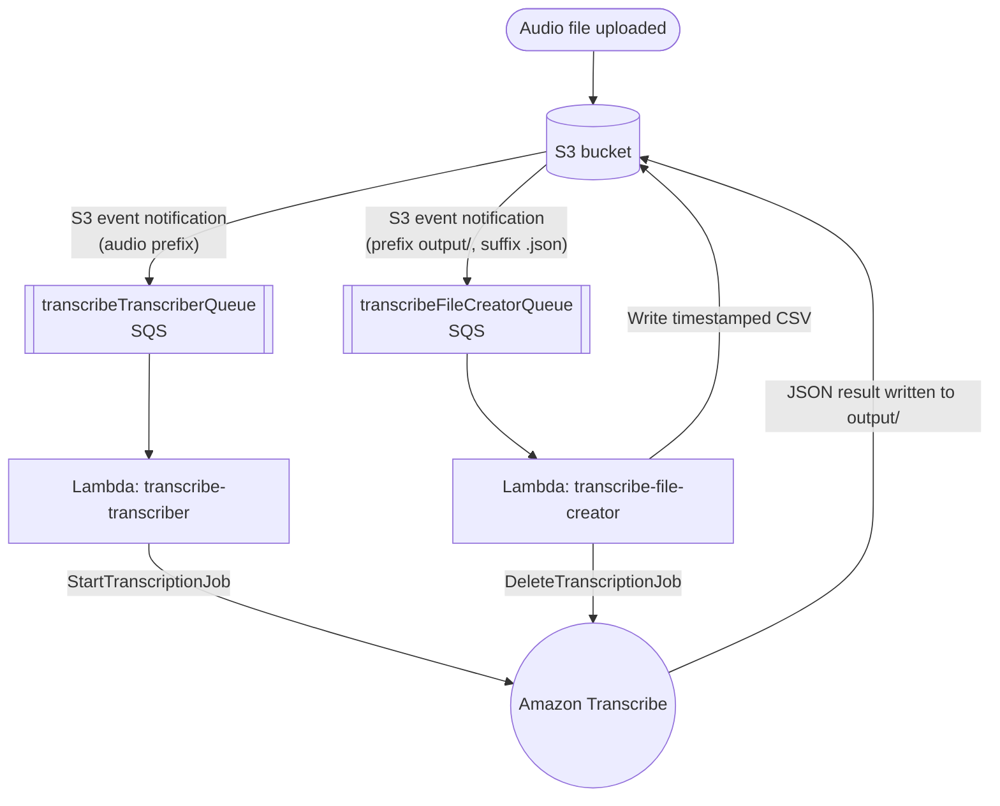

# convert-speech-to-text

> Drop an audio file into S3, get a timestamped CSV transcript back — fully serverless, deployed with Terraform.

[](https://github.com/ryo8000/convert-speech-to-text/actions/workflows/python-app.yml)
[](./LICENSE)
[](https://www.python.org/)
[](https://www.terraform.io/)

**convert-speech-to-text** is an event-driven, serverless pipeline on AWS that turns audio files into
timestamped transcripts. Upload an audio file to an S3 bucket and, a short time later, a CSV transcript —
complete with per-word start/end timestamps — appears back in the same bucket. Amazon Transcribe does the
speech recognition; two small AWS Lambda functions do the orchestration; Terraform provisions everything.

🇯🇵 [日本語版はこちら (Japanese)](./README.ja.md)

## How it works

The pipeline is fully event-driven. An object created in S3 triggers an SQS message, which invokes a Lambda
function. There are two such stages: one that starts an Amazon Transcribe job, and one that turns the job's
JSON output into a CSV.



1. An audio file is uploaded to the S3 bucket under a prefix you choose.
2. An S3 event notification enqueues a message on **transcribeTranscriberQueue**.
3. The **transcribe-transcriber** Lambda receives the message and calls Amazon Transcribe's
   `StartTranscriptionJob`, pointing the output at the transcription destination key (default `output/`).
4. Amazon Transcribe writes its JSON result back to S3 under `output/`.
5. A second S3 event notification (prefix `output/`, suffix `.json`) enqueues a message on
   **transcribeFileCreatorQueue**.
6. The **transcribe-file-creator** Lambda reads the JSON, builds a CSV of per-word timestamps, writes it to the
   creation destination key (default `output/`), and then deletes the completed transcription job.

## Features

- **Fully serverless & pay-per-use** — S3, SQS, Lambda, and Amazon Transcribe only. No servers to manage and
  no idle cost.
- **Infrastructure as code** — the entire stack (IAM roles/policies, Lambda functions, SQS queues, event
  source mappings) is defined in Terraform.
- **Per-word timestamps** — the CSV output includes `start_time` and `end_time` for every recognised token, plus
  the full transcript.
- **Configurable language** — the transcription language is set via a Terraform variable (default `ja-JP`).
- **Structured JSON logs** — both Lambda functions emit JSON-formatted logs with a configurable application/system
  log level, ready for CloudWatch Logs Insights.
- **Least-privilege IAM** — each Lambda gets its own role scoped to just the queue, bucket, and Transcribe
  actions it needs.
- **Self-cleaning** — completed transcription jobs are deleted automatically after the CSV is produced.
- **Tested with moto** — AWS interactions are unit-tested against mocked AWS services using
  [moto](https://github.com/getmoto/moto).

## Example output

Given an audio file transcribed to *"Welcome to Amazon Transcribe."*, the pipeline produces a CSV like this:

| start_time | end_time | content                       |
| ---------- | -------- | ----------------------------- |
|            |          | Welcome to Amazon Transcribe. |
| 0.64       | 1.09     | Welcome                       |
| 1.09       | 1.21     | to                            |
| 1.21       | 1.74     | Amazon                        |
| 1.74       | 2.56     | Transcribe                    |
|            |          | .                             |

The first data row (with empty timestamps) is the full transcript; the remaining rows are the individual tokens
with their start/end times in seconds. Punctuation has no associated timestamps.

The file is written to `<creation destination key>/<original-file-name>.csv` (with defaults, `output/<name>.csv`).

## Prerequisites

- An AWS account, and credentials configured locally (e.g. via `aws configure` or environment variables).
- [Terraform](https://developer.hashicorp.com/terraform/downloads) `>= 1.2.0`.
- An existing S3 bucket to link this application to (create one ahead of time).

> The included dev container already bundles Python 3.12 and the tooling needed to develop and test the code.
> Terraform and AWS credentials are still required on the machine you deploy from.

## Quick start

1. **(First time only)** Prepare one S3 bucket that this application will be linked to.
2. **(First time only)** Initialise Terraform:

   ```bash
   ./bin/setup.sh
   ```

3. Deploy:

   ```bash
   ./bin/deploy.sh
   ```

4. When prompted, enter values for the required variables:

   - **AWS account id** — your AWS account ID.
   - **AWS S3 bucket** — the name of the S3 bucket you prepared.
   - **AWS region** — the region to deploy into. This must match the region of your S3 bucket.

5. Enter `yes` at the final confirmation prompt to apply. Terraform then creates the Lambda functions, SQS
   queues, IAM roles, and event source mappings.

6. **(First time only)** In the AWS console, open the S3 bucket you prepared and create **two** S3 event
   notifications so uploads and transcription results flow into the right queues:

   | # | Purpose                    | Prefix     | Suffix  | Event type               | Destination (SQS queue)        |
   | - | -------------------------- | ---------- | ------- | ------------------------ | ------------------------------ |
   | 1 | Audio file created         | your choice¹ | —       | All object create events | `transcribeTranscriberQueue`   |
   | 2 | Transcription JSON created | `output/`  | `.json` | All object create events | `transcribeFileCreatorQueue`   |

   ¹ Audio files uploaded under this prefix are the ones that get transcribed. Pick any prefix you like (and give
   each notification any name you like).

### Convert speech to text

Upload an audio file under the prefix you configured in notification #1. After a short time, the CSV transcript
is written to the creation destination key (`output/` by default) in the same bucket.

## Configuration

The deployment is configured through Terraform variables. Three are required and prompted for at deploy time;
the rest have defaults and can be overridden (for example with `-var`, a `.tfvars` file, or `TF_VAR_*`
environment variables).

| Variable                        | Default        | Description                                           |
| ------------------------------- | -------------- | ----------------------------------------------------- |
| `aws_account_id`                | *(required)*   | AWS account ID.                                       |
| `aws_s3_bucket`                 | *(required)*   | Name of the S3 bucket the app is linked to.           |
| `aws_region`                    | *(required)*   | AWS region to deploy into (must match the bucket).    |
| `service_name`                  | `transcribe`   | Prefix used to name the created resources.            |
| `aws_s3_transcription_dist_key` | `output`       | S3 key prefix where Transcribe writes its JSON.       |
| `aws_s3_creation_dist_key`      | `output`       | S3 key prefix where the CSV transcript is written.    |
| `aws_transcribe_language_code`  | `ja-JP`        | Language code passed to Amazon Transcribe.            |
| `lambda_application_log_level`  | `INFO`         | Application log level for the Lambda functions.       |
| `lambda_system_log_level`       | `INFO`         | System log level for the Lambda functions.            |
| `lambda_memory_size`            | `128`          | Lambda memory size (MB).                              |
| `lambda_runtime`                | `python3.12`   | Lambda runtime.                                       |
| `lambda_timeout`                | `5`            | Lambda timeout (seconds).                             |
| `lambda_event_batch_size`       | `10`           | Number of SQS messages per Lambda invocation.         |
| `sqs_delay_seconds`             | `0`            | SQS delivery delay (seconds).                         |
| `sqs_max_message_size`          | `262144`       | SQS maximum message size (bytes).                     |
| `sqs_message_retention_seconds` | `345600`       | SQS message retention (seconds).                      |
| `sqs_receive_wait_time_seconds` | `0`            | SQS long-poll wait time (seconds).                    |
| `sqs_visibility_timeout_seconds`| `30`           | SQS visibility timeout (seconds).                     |

> Note: `service_name` also determines the SQS queue names. With the default `transcribe`, the queues are
> `transcribeTranscriberQueue` and `transcribeFileCreatorQueue` — the names used when configuring the S3 event
> notifications above.

## Project structure

```
.
├── bin/
│   ├── setup.sh              # terraform init
│   └── deploy.sh             # terraform fmt && terraform apply
├── src/
│   ├── transcriber.py        # Lambda: starts the Amazon Transcribe job
│   ├── file_creator.py       # Lambda: builds the CSV and deletes the job
│   ├── config.py             # Reads configuration from environment variables
│   └── aws/
│       ├── s3.py             # S3 client wrapper
│       ├── transcribe.py     # Amazon Transcribe client wrapper
│       └── model/            # Dataclasses for S3 / SQS events and Transcribe output
├── tests/                    # unittest suite (mocked with moto)
├── main.tf                   # Lambda, SQS, IAM resources
├── variables.tf              # Input variables
├── outputs.tf                # Lambda ARNs
└── licenses/                 # License and third-party notices
```

## Development

This repository ships with a VS Code dev container that provides Python 3.12 and installs the project's
dependencies automatically.

1. Install [VS Code](https://code.visualstudio.com/), [Docker](https://www.docker.com/), and
   [Terraform](https://developer.hashicorp.com/terraform/downloads).
2. Install the **Dev Containers** (Remote Development) extension for VS Code and reopen the workspace in the dev
   container.

### Running the tests

Open the workspace in the dev container and either click **Testing** in the activity bar, or run the suite from a
terminal:

```bash
python -m unittest discover -s tests
```

The same suite runs in CI on every push and pull request to `main` via GitHub Actions.

## Contributing

Issues and pull requests are welcome. If you find a bug or have an idea for an improvement, please open an issue
to discuss it, or send a PR.

## License

This project is released under the **MIT License** — see [LICENSE](./LICENSE) for the full text. Third-party
license notices for bundled/used dependencies live in [`licenses/third-party/`](./licenses/third-party/).
